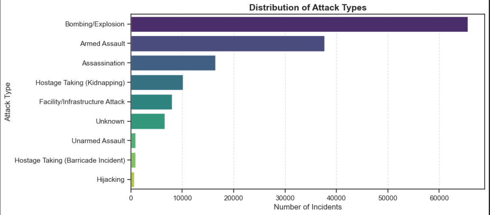
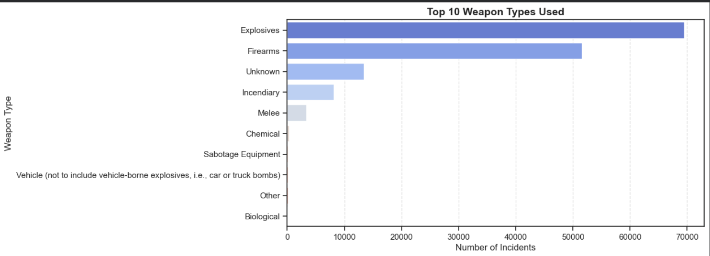

# 🌍 Global Terrorism — Exploratory Data Analysis


---

## 📌 What is this Project About?

This project performs a deep **Exploratory Data Analysis (EDA)** 
on the **Global Terrorism Database (GTD)** — one of the most 
comprehensive open-source databases on terrorist attacks worldwide.

The goal is to **understand patterns, trends and behaviors** 
in global terrorism by analyzing over **180,000 incidents** 
recorded between **1970 and 2017**.

By exploring this data we can answer questions like:
- 🔴 Which countries face the most terrorist attacks?
- 💣 What weapons are most commonly used?
- 🎯 Who are the most targeted victims?
- 📈 Has terrorism increased or decreased over time?
- ✅ How often do attacks succeed?

---

## 📊 About the Dataset

The **Global Terrorism Database (GTD)** is maintained by the 
**National Consortium for the Study of Terrorism and Responses 
to Terrorism (START)** at the University of Maryland.

| Feature | Details |
|---|---|
| 📁 Source | Global Terrorism Database (GTD) |
| 📝 Total Records | 180,000+ incidents |
| 📅 Time Period | 1970 — 2017 |
| 🌍 Countries Covered | 200+ countries |
| 📊 Total Columns | 135+ features |
| 🔑 Key Columns Used | 10 essential columns |

📥 **Download Dataset:** [Click Here](https://drive.google.com/file/d/1Vk17xK70g0wij_9xXcrEiXspUmoGRI0C/view?usp=sharing)

---

## 🔑 Key Columns Used in Analysis

| Column | Description |
|---|---|
| `iyear` | Year the attack took place |
| `country_txt` | Country where attack occurred |
| `region_txt` | World region of the attack |
| `city` | City where attack occurred |
| `attacktype1_txt` | Type of attack (Bombing, Shooting etc.) |
| `targtype1_txt` | Who was targeted (Military, Civilians etc.) |
| `weaptype1_txt` | Weapon used (Explosives, Firearms etc.) |
| `nkill` | Number of people killed |
| `nwound` | Number of people wounded |
| `success` | Whether attack was successful (1=Yes, 0=No) |

---

## 🔍 What EDA Was Performed?

### 1️⃣ Attack Type Distribution
Analyzed which types of attacks are most commonly used 
by terrorist groups worldwide.
- Bombing & Explosion dominates at ~50% of all attacks
- Armed Assault is the second most common type

### 2️⃣ Target Type Analysis
Identified who gets targeted the most in terrorist attacks.
- Private Citizens & Property are the most targeted
- Military and Government entities follow closely

### 3️⃣ Weapon Type Analysis
Explored what weapons terrorists use most frequently.
- Explosives are the most commonly used weapon
- Firearms are the second most used weapon type

### 4️⃣ Regional Analysis
Compared terrorism levels across different world regions.
- Middle East & North Africa has the highest incidents
- South Asia follows as the second most affected region

### 5️⃣ Yearly Trend Analysis
Tracked how terrorism has evolved over the decades.
- Terrorism was relatively low before 1990
- Significant spike observed after 2000
- Peak reached around 2014 due to ISIS activities

### 6️⃣ Casualty Analysis
Studied kill and wound patterns across all incidents.
- Total 297,700+ people killed globally
- Total 751,700+ total casualties recorded

---

## 📸 EDA Visualizations

### Attack Type Distribution



---

## 💡 Key Insights Discovered
✅ 88.27% of all recorded attacks were successful
💣 Bombing & Explosion accounts for ~50% of all attacks
🌍 Middle East & South Asia account for 50%+ of incidents
🎯 Private Citizens are the most targeted group
🔫 Explosives are the most commonly used weapon
📈 Terrorism increased significantly after 2000
⚡ Peak terrorism activity recorded around 2014
🇮🇶 Iraq, Pakistan & Afghanistan are top 3 risk countries

---

## 🛠️ Tools & Technologies Used

| Tool | Version | Purpose |
|---|---|---|
| 🐍 Python | 3.12 | Core programming language |
| 🐼 Pandas | Latest | Data loading and manipulation |
| 🔢 NumPy | Latest | Numerical computations |
| 📊 Matplotlib | Latest | Creating static visualizations |
| 🎨 Seaborn | Latest | Statistical data visualization |
| 📓 Jupyter Notebook | Latest | Development environment |

---

## 📁 Repository Structure
Global-Terrorism-EDA/
│
├── 📓 EDA_Global_Terrorism_Analysis.ipynb
│      Main EDA notebook with all analysis and visualizations
│
├── 📸 attack_type.png
│      Screenshot of attack type distribution chart
│
└── 📄 README.md
Project documentation

---

## 🚀 How to Run This Project

### Option 1 — Run on Google Colab (Recommended)
1. Click the notebook file above
2. Click **Open in Colab** button
3. Upload the GTD dataset
4. Click **Runtime → Run All**

### Option 2 — Run Locally on Jupyter
1. Clone this repository:
```bash
git clone https://github.com/deanneanthony/Global-Terrorism-EDA.git
```
2. Install required libraries:
```bash
pip install pandas numpy matplotlib seaborn jupyter
```
3. Open Jupyter Notebook:
```bash
jupyter notebook
```
4. Open `EDA_Global_Terrorism_Analysis.ipynb` and run all cells

---

## 👩‍💻 About the Author
**Deanne Anthony**
- 🎯 Objective: Predict Type of Terrorist Attack
- 👥 Part of Global Terrorism Analysis Team Project
- 📊 Responsibilities: EDA + ML Model Building + Power BI Dashboard

---

## 🔗 Related Links
- 📊 [ML & Dashboard Repository](coming soon)
- 🗄️ [Dataset Source](https://www.start.umd.edu/gtd/)

---
⭐ If you found this project useful please consider giving it a star!
